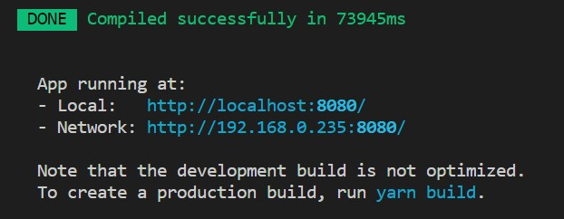
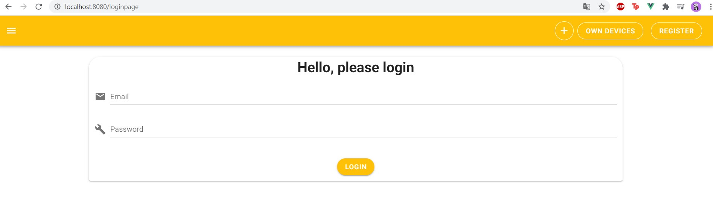
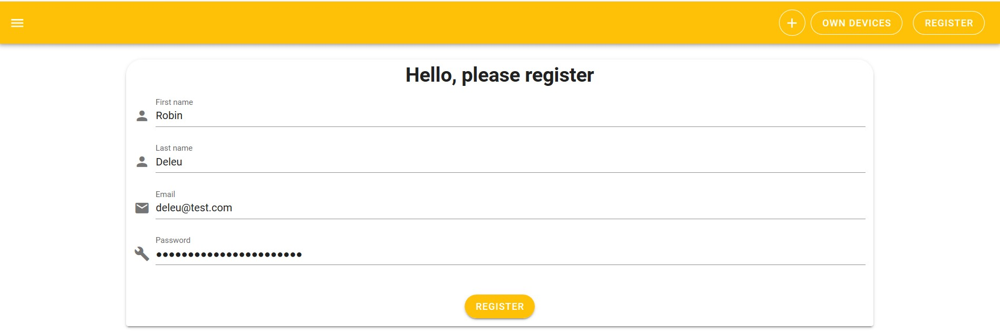
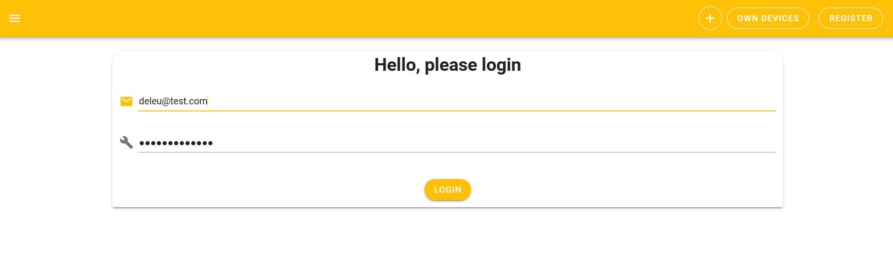
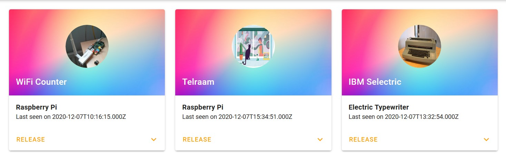
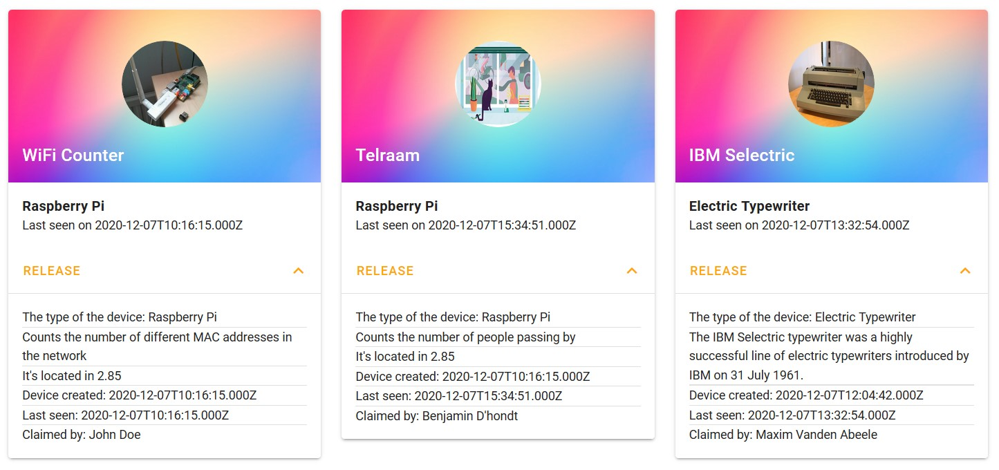
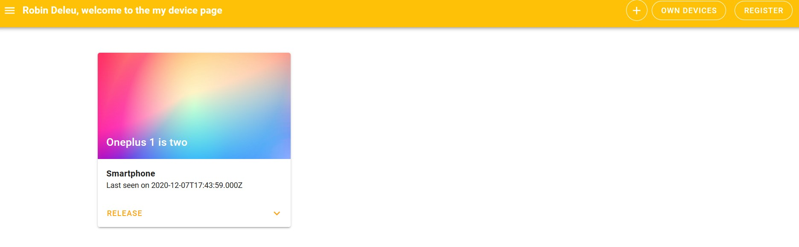
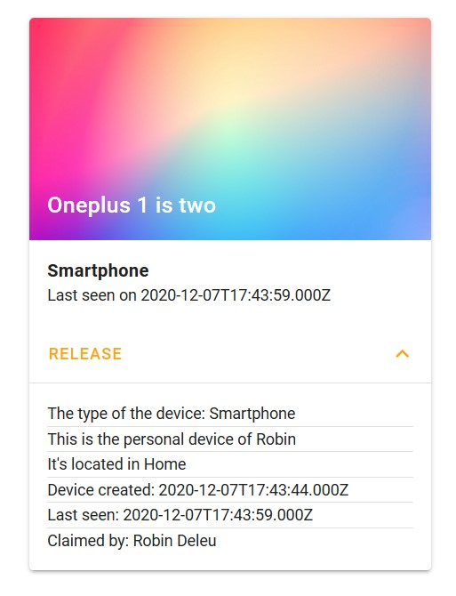
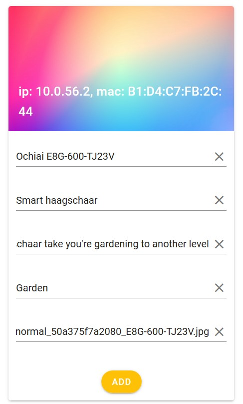
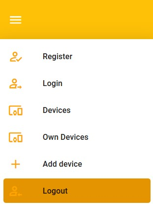

# Mobile Apps Challenge - My Devices by Robin Deleu

[](https://lbesson.mit-license.org/)

My Devices is a web application that allows network devices (such as for example a Raspberry Pi) to be detected and claimed by the owner. Basic information about a network devices is stored in a database and made available through a Vue frontend application.

The applications consists of several components:

* the detection script: this detects the network devices and gathers some basic information as ip, mac address and posts the information to the backend.
* the backend: provisions an API that can be used by the detection script and the front end application.
* a database: that holds all the information about the users and their devices.
* a frontend application: allows the users to view and claims the network devices.

## Setting up the project

To use this project you must to use a [local backend](https://github.com/BioBoost/my-devices-compose) or use a backend that's hosted by [school](https://api.mydevices.bioboost.dev).

To setup the frontend you will need npm and/or Yarn.
To install all dependencies you must run these commands:

```bash
npm install
```

```bash
yarn install
```

Once you did this you can serve or build the project with following commands:

To serve:

```bash
yarn run serve
```

To build:

```bash
yarn run build
```

After this you must see this in the console. And you can go to localhost:8080 in you're browser.





To make sure you're backend work. Put the right configuration in the .env file.
For local use:

```bash
VUE_APP_BACKEND_HOST=localhost
VUE_APP_BACKEND_PORT=8081
```

To host:

```bash
VUE_APP_BACKEND_HOST=BACKEND_URL_HERE
VUE_APP_BACKEND_PORT=OPTIONAL_PORT_HERE, ADD IT IN ./src/api.api.js on line 8.
```

## Usage

Access the data you must make a account or register.

### Register

If you don't have an account you must make one, just go to this link for the [hosted website](https://mobile-apps-rd.netlify.app/register) or this link for the [local page](https://localhost:8080/register)

There you enter you're full name, email adress and the password you want. There is a check to make sure you enter a email adress in the email field and also you must enter a safe password (more then 12 characters). After completing this, click the register button. This will register you and will make that you're logged in.

You can use it like this:



### Login

If you already have a email and password, just go to this link for the [hosted website](https://mobile-apps-rd.netlify.app/loginpage) or this link for the [local page](https://localhost:8080/loginpage)

You just must enter you're email adress and password. After pushing the login page you automatically go to the main screen.

You can login like this:



### Main info screen

If you're registered of logged in you can access all the data. Just go to this link for the [hosted website](https://mobile-apps-rd.netlify.app) or this link for the [local page](https://localhost:8080).
On the main screen you will see all registered devices. You will see just the minimum of information. Like the device name, the moment that the backend last saw the device and the device type.



If you push on the arrow you see more information about the device you want.



There is just another button to claim or release a device. This is made to claim you're own devices and if you go to the own device page you will just see you're own devices.

### Own devices

If you're registered of logged in you can access all the data. Just go to this link for the [hosted website](https://mobile-apps-rd.netlify.app/Owndevices) or this link for the [local page](https://localhost:8080/Owndevices). On the screen you see all registered devices that are from you. You will see just the minimum of information. Like the device name, the moment that the backend last saw the device and the device type.



If you push on the arrow you see more information about the device you want.



If you want to release the device just press release and the device will be gone from you're page.

### Add devices

If you're registered of logged in you can add devices in to the system. Just go to this link for the [hosted website](https://mobile-apps-rd.netlify.app/Adddevice) or this link for the [local page](https://localhost:8080/Adddevice).
On the screen you see all non-registered devices. If you wan't to add a device just fill in all the fields and press add.
If you look on the main screen you will see that you're device is added.



### Logout

If you want to leave the page you can logout by pressing on logout from the left menu.



## Authors

* **Robin Deleu** - *Student VIVES University of Applied Sciences*

## License

This project is licensed under the MIT License see the [LICENSE.md](LICENSE.md) file for details.
