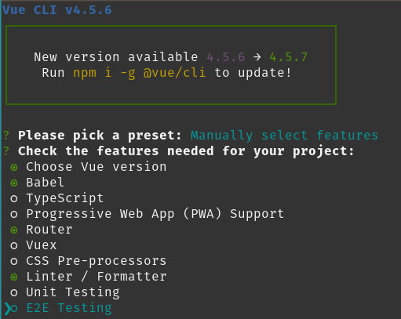
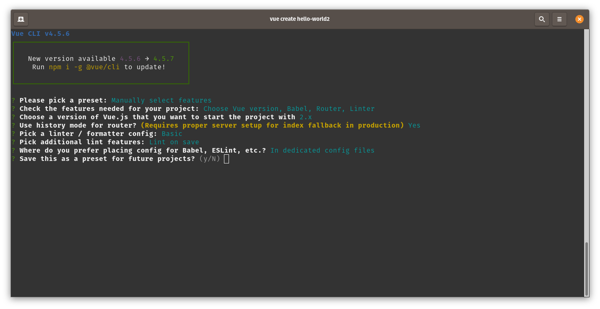

# Mobile Apps Challenge - My Devices

My Devices is a web application that allows network devices (such as for example a Raspberry Pi) to be detected and claimed by the owner. Basic information about a network devices is stored in a database and made available through a Vue frontend application.

The applications consists of several components:

* the detection script: this detects the network devices and gathers some basic information as ip and mac address and posts the information to the backend.
* the backend: provisions an API that can be used by the detection script and the front end application.
* a database: that holds all the information about the users and their devices.
* a frontend application: allows the users to view and claim devices.

Most of these components are already build or being build as we speak.

Except for the frontend application. This will be your task.

Make sure to commit regularly.

## Creating the frontend application

Start by creating a new Vue application in this repository. Choose to `Manually select features` when you need to pick a preset.

Now also enable the `Router` component as shown in the screenshot:

Next keep the defaults:

### Setup Vuetify

As a first package add vuetify to your App.

### Vue Router

Before starting on your journey you should watch this YouTube video about routing in Vue.js: [Vue: Routing For Dummies](https://www.youtube.com/watch?v=-uCUCmrNgeo). The require part is from the beginning till `14:18`.

## Create basics Views

Create the following views which will be needed later on. You don't have to add any functionality yet. Just display some fake information which can later be replaced by the real data.

* A register page that allows the user to enter:
  * a nickname
  * an email address
  * a password
* A login page
  * using an email address
  * a password
* A device page that displays the following information (examples provided):
  * the name of the device: `Thumper Control`
  * the type of the device: `Raspberry Pi Zero`
  * the IP address of the device: `10.0.1.23`
  * the MAC address of the device: `AA:BB:CC:DD:EE:FF`
  * the owner of the device: `Nico De Witte`
  * an image of the device: `https://opencircuit.nl/resources/content/90d45c2fda1c6/crop/900-600/Dagu-Wild-Thumper-6WD-all-terrain-chassis.-black-with-metallic-red-hubs..jpg`
  * The timestamp of when it was last seen: `10/14/2020, 8:10:12 PM`
* A device overview page. You can just leave this empty for the moment.

You can add some basic navigation for the moment as was shown in the YouTube video.

## Add Authentication

Follow this guide to add authentication: [https://github.com/BioBoost/mobile-apps-authentication-demo](https://github.com/BioBoost/mobile-apps-authentication-demo)

## Claiming and Releasing devices

Allow the user to claim a device or release a device.

## User Device overview

A user should be able to view only his/her devices.
